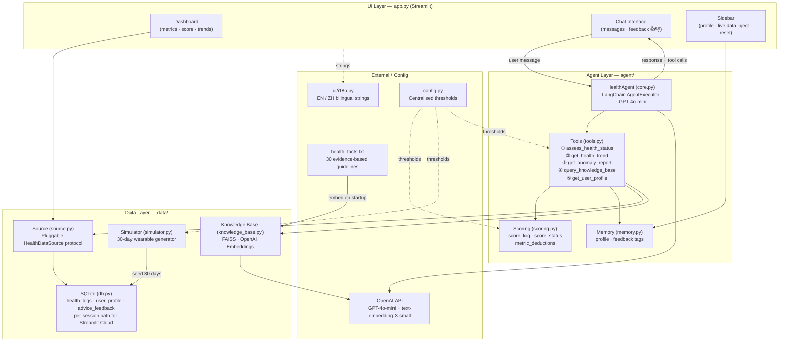

# HealthAgent 🫀

AI-powered personal health monitoring demo: it reads daily wearable-style metrics (simulated or injected), runs a **LangChain ReAct agent** with tools, and answers in **English or Chinese** via the Streamlit UI.

## Live Demo （constructing...）
👉 [health-agent-fengyuan.streamlit.app](https://health-agent-fengyuan.streamlit.app)（temporary out of use)

## Source code

👉 **[github.com/FengyuanLiu1101/health-agent](https://github.com/FengyuanLiu1101/health-agent)** — default branch for the latest work is **`main`** (older coursework may still exist on **`master`**).

## What It Does

| Area | Behavior |
|------|----------|
| **Proactive check-in** | On first load (with API key), the agent runs a morning-style analysis without you typing first. |
| **Daily briefing** | A short AI summary of today’s numbers; uses a **separate agent instance** so it does not mix into chat history. |
| **Chat** | Ask questions; the agent pulls logs, trends, knowledge, and profile through tools. |
| **Dashboard** | Today’s metrics, score, highlights, derived “vitals” (demo formulas), weekly steps chart, trends. |
| **Feedback** | Thumbs up/down on replies; repeated downvotes on a topic steer the model away (`disliked_advice_tags`). |
| **Live data** | Sidebar: inject today’s HR/steps/sleep/calories or use quick scenarios (high HR, post-workout, poor sleep). |
| **Session telemetry** | Sidebar expander: last runs show **token counts** (when the OpenAI callback is available) and **tool-call counts**. |
| **Non-medical notice** | Sidebar disclaimer: not medical advice; not for diagnosis or treatment. |
| **CI** | GitHub Actions runs `pytest` on push/PR (see `.github/workflows/ci.yml`). |

## Agent Tools (5)

1. **`assess_health_status`** — Score, status, flags, and raw metrics for a given day (default: today).  
2. **`get_health_trend`** — Rolling window (1–30 days): averages, min/max, trend direction per metric, anomalous-day count.  
3. **`get_anomaly_report`** — Lists days flagged `anomaly_flag` with heuristic “reason” tags for episodic context.  
4. **`query_knowledge_base`** — RAG over a small curated corpus (`health_facts.txt`) via **FAISS** + OpenAI embeddings.  
5. **`get_user_profile`** — Name, age, goal, liked/disliked advice tags, recent feedback rows.

The system prompt instructs the model **not to invent citations** if the knowledge tool returns an error or empty facts.

## Architecture



### Message data-flow (one user turn)

1. User sends a message in the chat.
2. `HealthAgent.chat()` passes it to the **LangChain AgentExecutor**.
3. GPT-4o-mini decides which tools to call — always starts with `assess_health_status`.
4. Tools query **SQLite** (via the pluggable `data/source.py`), **FAISS**, and **memory**.
5. GPT-4o-mini synthesises a personalised reply (≤200 words) in the user's language, honouring `disliked_advice_tags`.
6. The reply is streamed back to the Streamlit chat interface.
7. User clicks 👍 or 👎 → tag written to `advice_feedback` → steers next response.

## Memory Model

- **Short-term:** LangChain chat history on the main `HealthAgent` (not used by the briefing agent’s `run_ephemeral` path).  
- **Long-term:** SQLite `user_profile` (name, age, goal).  
- **Episodic / preference:** SQLite `advice_feedback` plus derived tags in the profile payload the agent reads.

## Data Layer

- **Writes:** `data/db.py` (simulator, profile, feedback, injected logs).  
- **Reads (pluggable):** `data/source.py` — `HealthDataSource` protocol and default `SqliteHealthDataSource`; agent tools read through `data.source` so a future wearable/API backend can be swapped in via `set_health_data_source()`.

## Tech Stack

- **UI:** Streamlit (`app.py`), bilingual strings in `ui/i18n.py` (default **中文**).  
- **Agent:** LangChain `AgentExecutor` + OpenAI tool-calling (`agent/core.py`).  
- **Model:** `gpt-4o-mini` by default (`HEALTH_AGENT_MODEL` override).  
- **RAG:** FAISS in-memory, rebuilt per process (see `data/knowledge_base.py`).  
- **Storage:** SQLite; Streamlit Cloud uses a **per-session temp DB** so visitors do not share one file.

## Run Locally

```bash
python -m venv .venv
.venv\Scripts\activate          # Windows
# source .venv/bin/activate     # macOS / Linux
pip install -r requirements.txt
cp .env.example .env
# Put OPENAI_API_KEY in .env
streamlit run app.py
```

### Configuration

| Variable | Purpose |
|----------|---------|
| `OPENAI_API_KEY` | Required for the LLM and embeddings. |
| `HEALTH_AGENT_MODEL` | Default `gpt-4o-mini`; e.g. `gpt-4o` for a larger model (higher cost). |
| `HEALTH_AGENT_DB_PATH` | Optional SQLite path for local scripts; Streamlit sets its own per-session path in `app.py`. |

### Tests

```bash
pip install pytest
pytest -q
```

The same tests run in **GitHub Actions** (`.github/workflows/ci.yml`) on push and pull request to `main` or `master`.

### Dependencies

`requirements.txt` pins first-party app dependencies (including **`openai==1.58.1`**, which matches `langchain-openai==0.2.14`’s lower bound). Use a **clean virtual environment** when installing so other global LangChain installs do not confuse the resolver.

## GitHub

Remote: `https://github.com/FengyuanLiu1101/health-agent.git`. Clone and run:

```bash
git clone https://github.com/FengyuanLiu1101/health-agent.git
cd health-agent
git checkout main
```

Contributors: after `git remote add origin …` (if you forked), use `git push -u origin main`.

## Notes

- All numeric health thresholds (HR ranges, sleep targets, score buckets, anomaly limits) live in `config.py` — edit once, propagates to scoring, simulation, anomaly detection, and the UI simultaneously.
- The FAISS index is rebuilt automatically on first run if `faiss_index/` is missing. Delete the folder to force a rebuild.
- Feedback tags are extracted from the agent's response text (sleep / exercise / diet / stress / general). Two thumbs-downs on a topic are required before it is added to `disliked_advice_tags` (prevents accidental suppression).

## Course

AI Agent Course — Final Project
